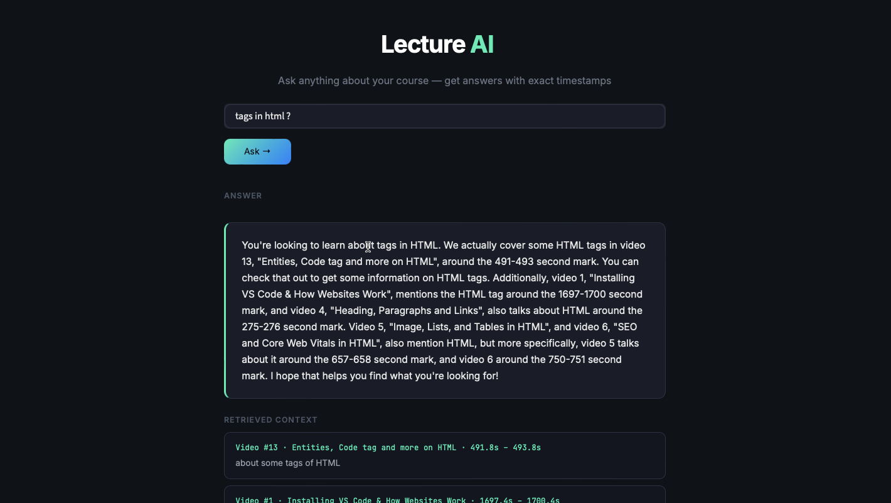

# 🎓 Lecture AI — RAG Teaching Assistant

An AI-powered teaching assistant that lets you ask natural language questions about your course and get answers with **exact video timestamps**. Built on a full RAG pipeline: video transcription → semantic embeddings → LLM inference.



---

## How It Works

```
Videos → FFmpeg (MP3) → Whisper (transcription) → FastEmbed (embeddings) → Groq LLM → Answer
```

1. **Video ingestion** — FFmpeg extracts audio from lecture videos
2. **Transcription** — OpenAI Whisper transcribes audio into timestamped chunks
3. **Embedding** — FastEmbed (BAAI/bge-small-en-v1.5, ONNX-based) converts chunks to vectors
4. **Retrieval** — Cosine similarity finds the top-K most relevant chunks for a query
5. **Generation** — Groq (llama-3.3-70b-versatile) generates a human-friendly answer with video references

---

## Tech Stack

| Layer | Tool |
|---|---|
| Transcription | OpenAI Whisper (large-v2) |
| Embeddings | FastEmbed — BAAI/bge-small-en-v1.5 (ONNX, no PyTorch) |
| Vector Search | scikit-learn cosine similarity |
| LLM Inference | Groq API — llama-3.3-70b-versatile |
| Frontend | Streamlit |
| Storage | joblib (embeddings cache) |

---

## Project Structure

```
Lecture-AI/
├── videos/               # Place your lecture videos here
├── audios/               # Auto-generated MP3 files
├── jsons/                # Auto-generated Whisper transcripts
├── embeddings.joblib     # Auto-generated vector store
├── video_to_mp3.py       # Step 1: Convert videos to MP3
├── mp3_to_json.py        # Step 2: Transcribe MP3 to JSON chunks
├── preprocess_json.py    # Step 3: Generate and save embeddings
├── process_incoming.py   # CLI query interface
├── app.py                # Streamlit web UI
├── .env                  # API keys (not committed)
└── README.md
```

---

## Setup

### 1. Clone the repo

```bash
git clone https://github.com/kannan05-m/Lecture-AI.git
cd Lecture-AI
```

### 2. Create a conda environment

```bash
conda create -n lecture-ai python=3.10 -y
conda activate lecture-ai
```

### 3. Install dependencies

```bash
python -m pip install fastembed groq scikit-learn joblib pandas python-dotenv openai-whisper streamlit
```

Also install FFmpeg:
```bash
brew install ffmpeg   # Mac
# or
sudo apt install ffmpeg  # Linux
```

### 4. Set up your Groq API key

Create a `.env` file in the project root:
```
GROQ_API_KEY=your_groq_api_key_here
```
Get a free API key at [console.groq.com](https://console.groq.com)

---

## Usage

### Step 1 — Add your videos
Place lecture video files in the `videos/` folder.

### Step 2 — Run the pipeline (one-time setup)

```bash
# Convert videos to MP3
python video_to_mp3.py

# Transcribe MP3s to JSON chunks via Whisper
python mp3_to_json.py

# Generate and save embeddings
python preprocess_json.py
```

### Step 3 — Launch the app

```bash
streamlit run app.py
```

Or use the CLI:
```bash
python process_incoming.py
```

---

## Features

- 🔍 **Semantic search** across all lecture transcripts
- 🕐 **Exact timestamps** — know exactly where in the video to look
- 📋 **Retrieved context** — see which chunks were used to generate the answer
- ⚡ **Fast inference** — Groq runs llama-3.3-70b at ~300 tokens/sec
- 🪶 **Lightweight embeddings** — FastEmbed uses ONNX, no PyTorch/GPU needed

---

## Notes

- Change `language="hi"` to `language="en"` in `mp3_to_json.py` if your videos are in English
- Use `whisper.load_model("base")` instead of `large-v2` for faster transcription on slower machines
- The `embeddings.joblib` file must be regenerated if you add new videos

